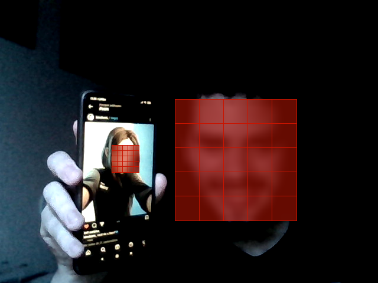

# Face Detector & Virtual Camera

Programa em Python que utiliza modelos pré-treinados para detecção de faces e objetos.

## Detector de Faces

Apenas para demonstração e _debug_. Abre a câmera automaticamente e exibe o resultado atual do código.

Para executar:

```shell
$ python3 face_detector.py
```

Para salvar uma imagem do _frame_ atual, pressione a tecla"**p**" a qualquer momento. Para fechar, pressione a tecla "**q**" com a janela de captura em foco.

## Câmera virtual

O programa utiliza o driver de câmera virtual do OBS Studio para transmitir o video modificado.

Para executar:

```shell
$ python3 virtual_cam.py
```

Ao transmitir em algum _software_, busque nas configurações e selecione como entrada de vídeo "OBS Virtual Camera".

Exemplo:


